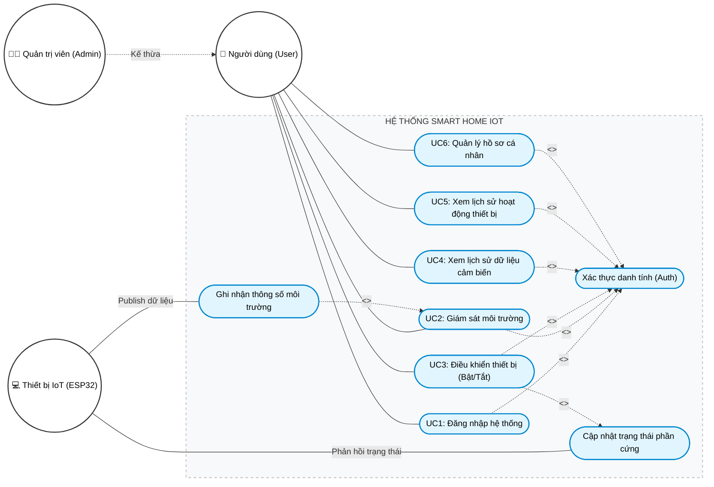

```mermaid
flowchart LR
    %% --- Định nghĩa các tác nhân (Actors) ---
    User(("👤 Người dùng (User)"))
    Admin(("🧑‍💼 Quản trị viên (Admin)"))
    ESP32(("💻 Thiết bị IoT (ESP32)"))

    %% Quan hệ kế thừa
    Admin -.->|Kế thừa| User

    %% --- Boundary của hệ thống ---
    subgraph System ["HỆ THỐNG SMART HOME IOT"]
        direction TB
        UC1(["UC1: Đăng nhập hệ thống"])
        UC2(["UC2: Giám sát môi trường"])
        UC3(["UC3: Điều khiển thiết bị (Bật/Tắt)"])
        UC4(["UC4: Xem lịch sử dữ liệu cảm biến"])
        UC5(["UC5: Xem lịch sử hoạt động thiết bị"])
        UC6(["UC6: Quản lý hồ sơ cá nhân"])
        Auth(["Xác thực danh tính (Auth)"])
        
        UC_Sys_1(["Ghi nhận thông số môi trường"])
        UC_Sys_2(["Cập nhật trạng thái phần cứng"])
    end

    %% --- Liên kết Actor -> Use Case ---
    User --- UC1
    User --- UC2
    User --- UC3
    User --- UC4
    User --- UC5
    User --- UC6

    ESP32 ---|"Publish dữ liệu"| UC_Sys_1
    ESP32 ---|"Phản hồi trạng thái"| UC_Sys_2

    %% --- Quan hệ Include / Extend ---
    UC1 -.->|<<include>>| Auth
    UC2 -.->|<<include>>| Auth
    UC3 -.->|<<include>>| Auth
    UC4 -.->|<<include>>| Auth
    UC5 -.->|<<include>>| Auth
    UC6 -.->|<<include>>| Auth

    UC_Sys_1 -.->|<<extend>>| UC2
    UC3 -.->|<<include>>| UC_Sys_2

    %% --- Style / Giao diện ---
    classDef actor fill:#ffffff,stroke:#333,stroke-width:2px,color:#000
    classDef usecase fill:#e1f5fe,stroke:#0288d1,stroke-width:2px,color:#000
    classDef system fill:#f8f9fa,stroke:#ccc,stroke-width:2px,stroke-dasharray: 5 5
    
    class User,Admin,ESP32 actor
    class UC1,UC2,UC3,UC4,UC5,UC6,Auth,UC_Sys_1,UC_Sys_2 usecase
    class System system
```
